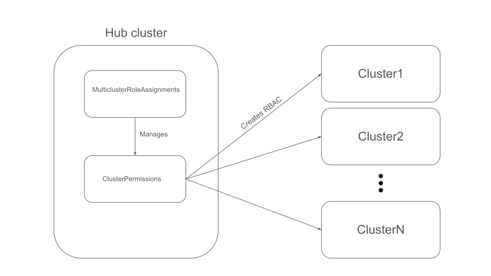

# Multicluster Role Assignment Operator

[](https://opensource.org/licenses/Apache-2.0)
[](https://goreportcard.com/report/github.com/stolostron/multicluster-role-assignment)

The Multicluster Role Assignment Operator is a Kubernetes operator that manages role-based access control (RBAC) across multiple clusters in a multicluster environment. It provides a declarative way to assign cluster roles to users, groups, or service accounts across multiple managed clusters.

## Overview

This operator simplifies the management of RBAC policies in multicluster environments by providing:

- **Centralized RBAC Management**: Define role assignments once and apply them across multiple clusters
- **Flexible Cluster Selection**: Target specific clusters for role assignments
- **Namespace-scoped Permissions**: Control access to specific namespaces within target clusters
- **Declarative Configuration**: Use Kubernetes custom resources to define and manage role assignments
- **Status Reporting**: Monitor the status of role assignments across all target clusters

## Architecture



Creating `MulticlusterRoleAssignment` resources will create `ClusterPermission` resources which in turn creates the RBAC resources in the targeted managed clusters. The RBAC resources can be `ClusterRoleBinding` or `RoleBinding`. For more information on `ClusterPermission` resources, refer to the [ClusterPermission repo](https://github.com/stolostron/cluster-permission).

## Quick Start

### Prerequisites

- Kubernetes cluster (1.25+)
- [Open Cluster Management](https://open-cluster-management.io/) hub cluster
- Managed clusters registered with the hub
- `kubectl` configured to access your cluster

### Installation

1. **Install the operator**:
   ```bash
   kubectl apply -k config/default
   ```

2. **Verify the installation**:
   ```bash
   kubectl get pods -n multicluster-role-assignment-system
   ```

### Basic Usage

Create a `MulticlusterRoleAssignment` to grant a user view access to specific clusters:

```yaml
apiVersion: rbac.open-cluster-management.io/v1alpha1
kind: MulticlusterRoleAssignment
metadata:
  name: developer-view-access
  namespace: open-cluster-management-global-set
spec:
  subject:
    kind: User
    name: jane.developer
    apiGroup: rbac.authorization.k8s.io
  roleAssignments:
  - name: view-access
    clusterRole: view
    targetNamespaces:
    - development
    - staging
    clusterSelection:
      type: clusterNames
      clusterNames:
      - cluster-east
      - cluster-west
```

This example:
- Grants the user `jane.developer` the `view` cluster role
- Applies the role to the `development` and `staging` namespaces
- Targets the `cluster-east` and `cluster-west` managed clusters

## API Reference

### MulticlusterRoleAssignment

The `MulticlusterRoleAssignment` custom resource defines role assignments across multiple clusters. The referenced role must exist on the managed clusters.

#### Spec Fields

| Field | Type | Description | Required |
|-------|------|-------------|----------|
| `subject` | `rbacv1.Subject` | The user, group, or service account for the role assignment | Yes |
| `roleAssignments` | `[]RoleAssignment` | List of role assignments for different clusters | Yes |

#### RoleAssignment Fields

| Field | Type | Description | Required |
|-------|------|-------------|----------|
| `name` | `string` | Name of the role assignment | Yes |
| `clusterRole` | `string` | Name of the cluster role to assign | Yes |
| `targetNamespaces` | `[]string` | Namespaces to apply the role (all if empty) | No |
| `clusterSelection` | `ClusterSelection` | Cluster selection criteria | Yes |

#### ClusterSelection Fields

| Field | Type | Description | Required |
|-------|------|-------------|----------|
| `type` | `string` | Type of cluster selection (currently only `clusterNames`) | Yes |
| `clusterNames` | `[]string` | List of cluster names to target | Yes |

#### Status

The operator reports the status of each role assignment, including:
- Overall conditions for the `MulticlusterRoleAssignment`
- Individual status for each role assignment (Pending, Active, Error)
- Detailed messages for troubleshooting

## Examples

### Multiple Role Assignments

```yaml
apiVersion: rbac.open-cluster-management.io/v1alpha1
kind: MulticlusterRoleAssignment
metadata:
  name: admin-multi-role
spec:
  subject:
    kind: User
    name: admin-user
    apiGroup: rbac.authorization.k8s.io
  roleAssignments:
  - name: prod-admin
    clusterRole: admin
    targetNamespaces:
    - production
    clusterSelection:
      type: clusterNames
      clusterNames:
      - prod-cluster-1
      - prod-cluster-2
  - name: dev-edit
    clusterRole: edit
    targetNamespaces:
    - development
    clusterSelection:
      type: clusterNames
      clusterNames:
      - dev-cluster-1
```

### Service Account Assignment

```yaml
apiVersion: rbac.open-cluster-management.io/v1alpha1
kind: MulticlusterRoleAssignment
metadata:
  name: monitoring-sa
spec:
  subject:
    kind: ServiceAccount
    name: monitoring-agent
    namespace: monitoring
  roleAssignments:
  - name: metrics-reader
    clusterRole: system:monitoring
    clusterSelection:
      type: clusterNames
      clusterNames:
      - cluster-1
      - cluster-2
      - cluster-3
```

## Development

### Prerequisites

- Go 1.24+
- Kubernetes cluster for testing

### Local Development

1. **Clone the repository**:
   ```bash
   git clone https://github.com/stolostron/multicluster-role-assignment.git
   cd multicluster-role-assignment
   ```

2. **Install dependencies**:
   ```bash
   go mod download
   ```

3. **Run tests**:
   ```bash
   make test
   ```

4. **Run the operator locally**:
   ```bash
   make install run
   ```

### Building and Deployment

1. **Build the operator image**:
   ```bash
   make docker-build IMG=<your-registry>/multicluster-role-assignment:latest
   ```

2. **Push the image**:
   ```bash
   make docker-push IMG=<your-registry>/multicluster-role-assignment:latest
   ```

3. **Deploy to cluster**:
   ```bash
   make deploy IMG=<your-registry>/multicluster-role-assignment:latest
   ```

### Make Targets

- `make help` - Display available make targets
- `make test` - Run unit tests
- `make build` - Build the operator binary
- `make docker-build` - Build the container image
- `make install` - Install CRDs to the cluster
- `make deploy` - Deploy the operator to the cluster
- `make undeploy` - Remove the operator from the cluster
- `make manifests` - Generate CRD and RBAC manifests
- `make generate` - Generate code (DeepCopy methods)

## Contributing

We welcome contributions! Please see our [Contributing Guidelines](CONTRIBUTING.md) for details on:

- Code of conduct
- Development process
- Submitting pull requests
- Reporting issues

### Development Workflow

1. Fork the repository
2. Create a feature branch
3. Make your changes
4. Add tests for new functionality
5. Run the test suite
6. Submit a pull request

## Troubleshooting

### Common Issues

1. **Role assignments not appearing on target clusters**:
   - Verify the target clusters are registered as ManagedClusters
   - Check the operator logs for connection issues
   - Ensure the specified cluster names match the ManagedCluster names

2. **Permission denied errors**:
   - Verify the operator has the necessary RBAC permissions
   - Check that the target cluster roles exist
   - Ensure the subject (user/group/SA) is valid

3. **Status shows "Error" for role assignments**:
   - Check the detailed message in the status
   - Verify network connectivity to target clusters
   - Ensure the target namespaces exist

## Security Considerations

- The operator requires cluster-admin privileges to manage RBAC across clusters
- Role assignments are applied with the permissions of the operator's service account
- Ensure proper network policies and access controls are in place
- Regularly audit role assignments and their usage
